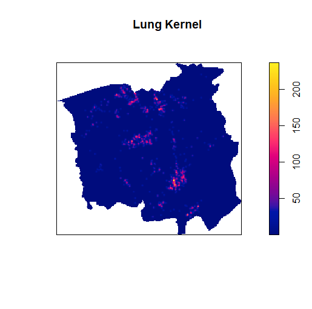
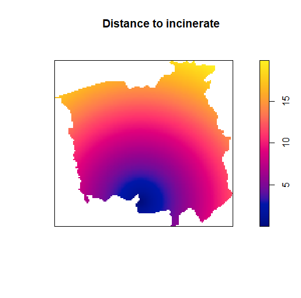
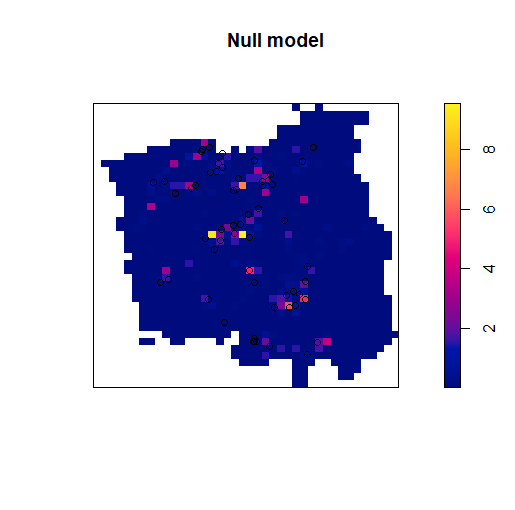
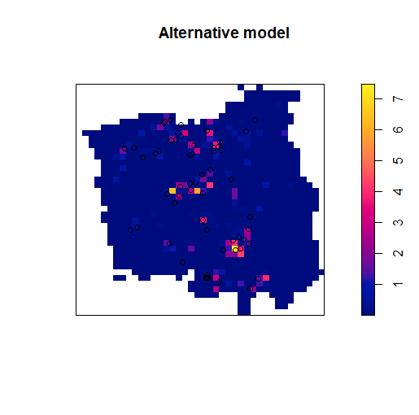

# laryngeal_cancer-the_incinerator

<font face="Times new" size=3 align="justify"> 

## Introduction of Chorley-Ribble data

Chorley-Ribble data is marked as point pattern. it represents the precise domicile addresses of new cases of cancer of the larynx (58 cases) and cancer of the lung (978 cases), recorded in the Chorley and South Ribble Health Authority of Lancashire (England) between 1974 and 1983. Furthermore, the coordinate of the location of a disused industrial incinerator also was stored as class members. By processing above information, we aim to find the evidence of the relationship between laryngeal cancer and incinerator, more specifically, the evidence that the closer to the incinerator, the higher of the incidence of laryngeal cancer.  

The incidence of lung cancer is relatively irrelevant to the disused industrial incinerator. Therefor lung cancer’s data is an alternative index of the spatially varying density of the susceptible population which is the another covariable of research object.

After data analysis, result shows significant evidence implying that the incidence of laryngeal cancer is indeed dependent to the relative distance from the incinerator.

## Hypothesis Model and Research Method

To determinate the incinerator’s effect, the null hypothesis was set as that the point process of cases of cancer of the larynx is a Poisson process with intensity, which can be express as $λ(u) = p_1h(u)$, where $h(u)$ is the spatially varying density of the susceptible population and $p_1$ is a constant imply the probability of contracting cancer of the larynx. $h(x)$ can be obtained by smoothing the data of lung cancer, and in this case, we adopted kernel function to implement it. Same as above, locations of cases of lung cancer also can assume as a Poisson process with intensity, where $κ(u) = p_2 h(u)$.Therefore, the$ λ(u) = θ κ(u)$ also could be the null model to describe larynx cancer incidence, where $ θ$ equals to $\frac{p_1}{p_2}$.

The alternative models are Poisson processes with intensity $λ(u) =κ(u)l(d(u))$, where $d(u)$ is the distance from the location u to the industrial incinerator, and $l$ is some non-constant function of our choice.

## Research Details and Result Analysis  

```r
kernel_lung <- density(controls,sigma =bw.diggle(chorley), eps=0.1, positive=TRUE)
kernel_lung <- eval.im(pmax(kernel_lung, 1e-10))
```

The first step is using kernel smoothing the lung cancer data to estimate the lung cancer intensity. The Diggle and Berman’s mean square error cross-validation method was applied to select the bandwidth of kernel estimate. The generated bandwidth is 0.07321918. The pixels are eps=0.1km wide. The argument positive=TRUE ensures that negative or zero-pixel values (due to numerical error) are replaced by a small positive number([1],322), which can avoid the error when using ppm to fit the logarithm model. For same reason, eval.im() also was used in here to add a small number to each value of the “im” class. Moreover, the kernel function we used is the default Gaussian distribution. The result of kernel smoothing was presented in fig(1).

```r
Null<-ppm(cases,~offset(log(ker)),covariates=list(ker=kernel_lung))
```

To fit the null model, a Poisson process with intensity $λ(u) = θ κ(u)$, the ppm function in spatstat library was adopted. The build-in offset function was applied to set the offset of $log(\kappa(\theta))$, which is 1. The output of coefficient (Intercept, $θ$) is -3.108573 with strand error of 0.1313064, and the Z-test’s p-value < 0.001, implying that the coefficient is significant. So the null hypothesis’s fit model becomes

$λ(u) = e^{-3.108573} κ(u) =0.04466465κ(u)$

where κ(u) is the smoothed intensity of lung cancer cases

The next step is fitting alternative model which is Poisson processes with intensity $λ(u) =κ(u)l(d(u))$. Where $d(u)$ is the is the distance from the location u to the industrial incinerator whose coordinate was stored in the chorley.extra. It can be obtained by simply calculation of the Euclidean space distance.

$l$ is a function that we want to investigate, telling us how the intensity of points depends on the value of the covariate. I adoptted the Raised Incidence Model to construct the function $l$ and fit the data. The raised incidence model’s form should be like $\lambda(u)=b(u)e^{\theta_1+\theta_2Z(u)}$ (week 6-lecture 2). In this case, the baseline(b(u)) is $\kappa (u)$, the kernel function. According to our assumption, the closer of the incinerator, the higher of the incidence of laryngeal cancer. Therefore, $\theta_2$ should be a negative number. Besides, theoretically, if the distances from incinerator to some locations are infinite, then the incidence of laryngeal cancer in those locations will only depend on the probability of contracting cancer of the larynx and the spatially varying density of the susceptible population. In other words, when $d(u)\to ∞(e^{-d(u)}\to 0)$, the alternative model should approach to our null model. To realize it, we can simply add 1 to the exponential term in $l$ function. Hence, $l(.)$ was represented as the form $1+e^{\theta1-\theta2d(u)}$,and the log intensity is

$log(λ(u)) =log(κ(u))+log(\theta_0)+log(1+e^{\theta_1-\theta_2d(u)})$.

From above formula, in the log intensity function does not depend on $\theta_1$ and $\theta_2$ linearly, hence both are irregular parameters. Therefore, it is necessary to use “ippm” function ([1],364) to get MLE of them. Below are this step’s codes.

```r
dfun <- function(x,y) { sqrt((x-incin$x)^2 + (y-incin$y)^2) }
l <- function (x,y, exp_theta1, theta2) {1+exp_theta1 * exp( - theta2 * dfun(x,y))}
fit1 <- ippm(cases ~ offset(log(kernel_lung) + log(l)),start= list(exp_theta1=5, theta2=1))
```

The l defined in code is the function $l$ in Raised incidence model mentioned before. The implementation of ippm is similar to ppm. The first argument is the trend which defines the log intensity with the irregular part as an offset, while the second argument is a list containing initial values of each of the irregular parameters, which was used in the iterative algorithm of the calculation of irregular parameters MLE.[2](Note that iterative maximization may not converge because the parameters do not appear as logarithmically linear and the logarithmic likelihood may not be convex.([1],364))

By execute above code, $e^{\hat \theta_1}$ will equal to 22.10476, and $\hat{\theta_2}$= 1.445787. Meanwhile, the Intercept $\theta_0$ = -3.171519 whose z-test showed the p-value smaller than 0.001. So, it is significant.

So far, the two hypotheses model were derived. To determinate if the incinerator contributes to the incidence of laryngeal cancer, the analysis of deviance was applied, which in this case will test the significant of covariable by implement likelihood ratio test. The result indicates strong evidence against null hypothese in favor of the raised incidence alternative model (p-value=0.01055).


## Conclusion

After processing Chorley-Ribble’s data, there are significant evidences that show the incidence of laryngeal cancer increased near the abandoned industrial incinerators.

## Appendix

R-code

```r
library(spatstat)
cases <- split(chorley)$larynx
controls <- split(chorley)$lung
incin <- chorley.extra$incin
kernel_lung <- density(controls,sigma =bw.diggle(chorley), eps=0.1, positive=TRUE)
kernel_lung <- eval.im(pmax(kernel_lung, 1e-10))
dfun <- function(x,y) { sqrt((x-incin$x)^2 + (y-incin$y)^2) }
dinc <- as.im(dfun, chorley$window)
raisin <- function(x,y, exp_theta1, theta2) {1+exp_theta1 * exp( - theta2 * dfun(x,y))}
fit2 <- ippm(cases ~ offset(log(kernel_lung) + log(raisin)),start=list(exp_theta1=5, theta2=1))
fit1 <- update(chorleyDfit, . ~offset(log(kernel_lung)))
anova(fit1, fit2, test="LRT")
plot(kernel_lung,main="Lung Kernel")
plot(dinc,main="Distance to incinerate")
plot(fit1,main="Null model")
plot(fit2,main="Alternative model")

```






## Reference

[1] *Baddeley, Rubak,&Turner(2015). Spatial Point Patterns: Methodology and Applications with R.CRC Press*
[2] *<a href="https://www.rdocumentation.org/packages/spatstat/versions/1.59-0/topics/ippm">Fit Point Process Model Involving Irregular Trend Parameters</a>*
[3] *<a href="https://www.rdocumentation.org/packages/car/versions/3.0-3/topics/Anova">Anova Tables For Various Statistical Models</a>*

</font>
